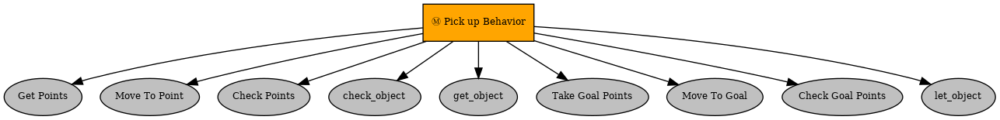

# HOP "Pickup objects" task using behavior trees

#### Group Member
 1.Syma Afsha

2. Mir Mohibullah Sazid

### Introduction    
In this lab, we have done picking up objects and place them in a destination location using Py Tree library. This lab is intregated with the previous lab in oder to plan the path of the robot with different obstacles. 

### How to run it
To execute the project file, at first it needs to be copied to the catkin workspace src floder and open a command prompt and run the following commands:
```bash
catkin build
```
after the it is successfully complied it needs to run a launch file. It can be done using the following commands
```bash
roslaunch pick_up_objects_task temp.launch
```
This command will launch the gazebo, octomap server, rviz, turtlebot_online_path_planning_node.py and manage_objects_node.py. After that, a new terminal needs to be opened and run the following commands. 
```bash 
rosrun pick_up_objects_task pickup_behaviors_node.py
```
It will execute the tasks that are difined. 

In oder the run the file without the intregation of first  lab. Please uncomment the file `pick_up_objects_task.launch` and run the following commands. 
```bash
roslaunch pick_up_objects_task pick_up_objects_task.launch
```
It will open the manage_objects_node.py and the turtlebot_controller_node.py. Then run the following commands in a new terminal to run the system. 
```bash 
rosrun pick_up_objects_task pickup_behaviors_node.py
```
## Example of use
In this lab, we have implemented the following behaviour tree in oder to run the files.
<div style="text-align: center">
    
</div>

At first, it was tested and run without the intregation of the previous lab which is captured in a video file [here](https://youtu.be/BtH838aQ-kY?si=FODpfT1BSSTDtfYa)

Then the intregation of the previous lab is captured in a video file [here](https://youtu.be/exelGb3x6Fo?si=CQTJ02IE5IFs8yYy)

The behaviour tree is working following these sequence conditions. They are given as follows:

1. **Get points:** It will take the points from the list of point that are given. It will visit one point once and after visiting all the points it will return failure. If it takes one point it will return success and go to the next behaviour. 
2. **Move to points:** After getting the points, it will move to the points it has got from the get points. 
3. **Check points:** It will check the point that is should reached. It takes the odometry value to get the current pose of the robot and check with desired points from the blackboard. If it fails to reach the point, it will return failure and start from the beganing. If it reaches the point, it will return success and continue to the next behaviour.
4. **Check_object:** Behavior for calling `check_object` task and if True, store object name to Blackboard. 
5. **get_object:** This behavior allows the robot to get the object after it successfully check the object.
6. **Take Goal Points:** This behavior allows the robot to take the goal points according to the `check_object` named stored in the blackboard and decides the goal points accordingly. 
7. **Move to goal:** This behavior allows the robot to move to the goal points it get from the previous behaviour. 
8. **Check goal points:** This behavior allows the robot whether it has reached the goal points it supposed to reached. If it reaches the goal points it will return success and continue to the next behaviour. If it fails to reach point it will return failure and start from the beginning. 
9. **let_object:** This will allow the robot to keep the object down and placed into the desired position. 

### Discussion
This lab will allow us to learn how to intregrate different tasks of robot by using different behaviour. This is small example of that. For the intregation of the previous lab, only the lauch file was changed to excute the intregation of the labs where it only uses its previous lab to plan the robot path with obstracles.  
